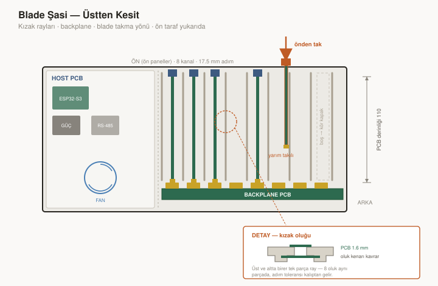
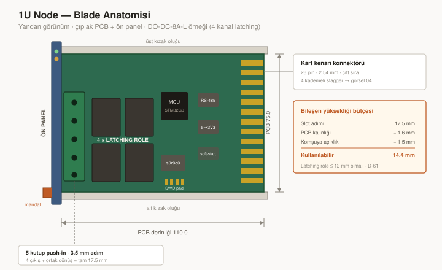
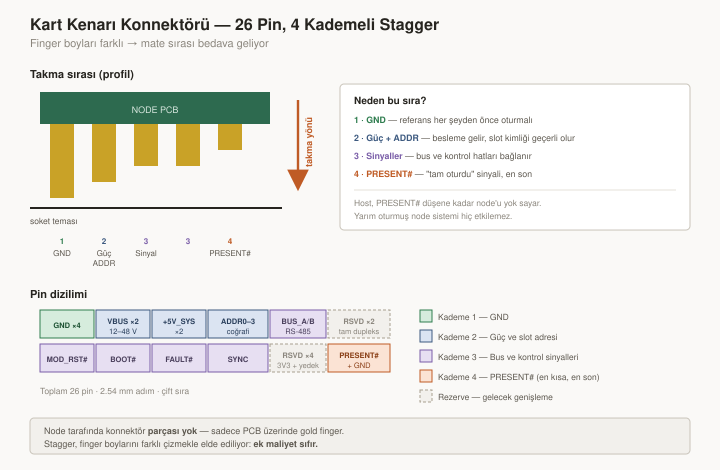
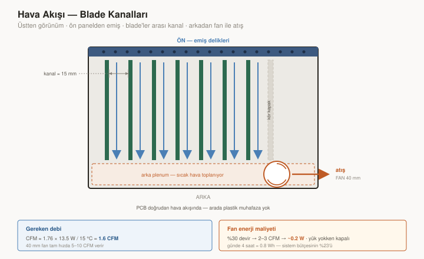

# 04 — Backplane ve Mekanik

> Bu dokümandaki kararlar **geriye dönük değiştirilemez**. Üretilmiş her node
> buraya bağlıdır.

---



## 1. Mekanik mimari: blade mi, kutu-içinde-kutu mu?

İki paradigma var ve bu seçim node maliyetinden termal tasarıma kadar her şeyi
belirliyor.

| | **(A) Kutu-içinde-kutu** | **(B) Gerçek blade** |
|---|---|---|
| Node | Kendi plastik muhafazası olan kapalı modül | **Çıplak PCB + ön panel**, kızağa sürülür |
| Benzer | Beckhoff / Wago DIN klemens modülleri | Blade server, VME / cPCI subrack |
| Node başı muhafaza maliyeti | $2–5 | **$0** |
| Isı yolu | PCB → hava → plastik → hava → şasi | **PCB → doğrudan hava kanalı** |
| Mekanik hizalama | Kutu toleransı + host toleransı | **Kızak, PCB kenarını boydan boya tutuyor** |
| Titreşim davranışı | PCB kutu içinde serbest, rezonans riski | **PCB iki kenarından 110 mm boyunca destekli** |
| EMI | Plastik ekranlamaz | **Metal şasi ekran** |
| Çıplak PCB teması | Yok | Servis sırasında var — ele alınmalı |

### Karar: (B) gerçek blade · D-60

Dört bağımsız gerekçe, hepsi karavan bağlamında ağır basıyor:

**1. Termal — belirleyici olan bu.**
[11 §6](11-cikis-node-topolojileri.md#6-iletim-kaybı-ve-termal)'da paketlenmiş
node'da doğal konveksiyonun yetmediğini hesaplamıştık. Kutu-içinde-kutu bunu
daha da kötüleştiriyor: plastik ısı iletkenliği ~0.2 W/mK, yani her node'un
etrafında bir yalıtım katmanı var. Blade'de PCB doğrudan zorlanmış hava
akışında.

**2. Node maliyeti — sekiz kez ödenen kalem.**
Muhafaza başına $2–5, 8 node'da $16–40. K1'in
([01 §3](01-sistem-genel-bakis.md#3-tasarımı-yöneten-kısıtlar)) tam olarak
kaçınmamızı söylediği türden bir maliyet.

**3. Titreşim (K5) — blade daha iyi.**
Sezgiye aykırı ama doğru: kızak, PCB'yi üst ve alt kenarından **110 mm boyunca
sürekli** destekliyor. Kutu içinde 4 vidayla tutulan bir PCB'nin rezonans
frekansı çok daha düşük. Karavan yol titreşiminde bu gerçek bir fark.

**4. Hizalama — kart kenarı konnektörünün ihtiyacı olan şey.**
Kızak, konnektöre giriş açısını ve yüksekliğini garantiliyor. Kutu-içinde-kutuda
iki tolerans zinciri üst üste biniyor.

### 1.1 Blade'in bedeli ve karşılığı

| Sorun | Çözüm |
|-------|-------|
| Servis sırasında çıplak PCB'ye temas (ESD) | Ön panel tutamak görevi görüyor; node'lar ESD poşetinde sevk edilir; ön panelde "PCB'ye dokunmayın" işareti |
| **AC node'larında şebeke teması** | Şebeke bölümünün üzerine **klipsli plastik kapak** — tam kutu değil, sadece bariyer. Ucuz, termal avantajı kaybetmiyor |
| Toz / nem | Şasi sorumluluğu — ön panel dizisi kapalı yüzey oluşturur, boş slotlara kör kapak |
| Klemens kuvvetleri PCB'ye biniyor | Ön panel PCB'ye köşebent + 2 vida ile rijit bağlanır; kuvvet panelden şasiye aktarılır |

---

## 2. Slot ve node ölçüleri

Çalışma draftı Rev 0.1'den alınan gerçek ölçüler
([12 §1](12-mekanik-referans-rev01.md#1-drafttan-alınan-somut-veriler)) · D-58

| | 1U | 2U |
|---|-----|-----|
| **Slot adımı** | **17.5 mm** | **35.0 mm** |
| Ön panel | 17.5 × ~80 mm | 35.0 × ~80 mm |
| PCB (yükseklik × derinlik) | ~75 × 110 mm | ~75 × 110 mm |
| PCB kalınlığı | 1.6 mm | 1.6 mm |

```
Node slotları   =  8 × 17.5  =  140 mm
Host slotu (2U) =              35 mm     ← node kapasitesi tüketmez
                               ───────
Toplam slot alanı            = 175 mm    (+ duvarlar ≈ 185 mm)
```

**Host da bir blade** — node'larla aynı kızak, ön panel ve mandal sistemini
kullanır, kendi özel slotunda durur. Gerekçe ve alan hesabı:
[02 §7](02-host-mimarisi.md#7-hostun-mekanik-formu) · D-66

> ⚠️ **Host konnektörü node konnektöründen farklıdır** (slot başına
> RST#/PRESENT# hatları host'a gider). **Mekanik keying zorunlu** — node host
> slotuna, host node slotuna takılamamalı.

**17.5 mm neden doğru:** Modüler şalt cihazlarının (sigorta, kontaktör) tek
kutup genişliği 17.5/18 mm — yani DIN ekosistem argümanı geçerli. Ve 22.5 mm'ye
göre cihazı **40 mm daraltıyor**; karavanda hacim pahalı.



### 2.1 Bileşen yüksekliği bütçesi — kritik kısıt

Blade'de muhafaza duvarı olmadığı için 17.5 mm'nin tamamı kullanılabilir, ama
komşu blade'e çarpmamak gerekiyor:

```
Slot adımı                  17.5 mm
PCB kalınlığı              − 1.6 mm
Komşuya emniyet açıklığı   − 1.5 mm
                            ───────
Bileşen yüksekliği bütçesi   14.4 mm   (tek yüzde)
```

> ⚠️ **Bu, latching röle seçimini doğrudan kısıtlıyor.** Tipik güç röleleri
> 15–25 mm yüksekliğinde. **1U node'larda ≤ 12 mm alçak profilli latching röle
> zorunlu.** Parça seçiminde doğrulanacak; uygun röle bulunamazsa 8 A latching
> node'u 2U'ya çıkmak zorunda kalır · D-61
>
> MOSFET node'larında böyle bir sorun yok — alçak profilli.

---

## 3. Şasi ve kızak sistemi

### 3.1 Kızak — 16 parça değil, 2 parça

```
        ┌──────────────────────────────────────────┐
        │  ÜST KIZAK RAYI (tek parça, 8 oluk)      │
        ├──┬──┬──┬──┬──┬──┬──┬──┬──────────────────┤
        │  │  │  │  │  │  │  │  │                  │
   PCB →│  │  │  │  │  │  │  │  │  ← 17.5 mm adım  │
        │  │  │  │  │  │  │  │  │                  │
        ├──┴──┴──┴──┴──┴──┴──┴──┴──────────────────┤
        │  ALT KIZAK RAYI (tek parça, 8 oluk)      │
        └──────────────────────────────────────────┘
                          ↓
              arka: backplane PCB + kart kenarı soketleri
```

Slot başına iki ayrı kızak parçası (16 adet) yerine **üstte ve altta birer
kalıplı/ekstrüzyon ray.** Sonuç:

- 2 parça, 16 değil → montaj ve maliyet
- Oluklar aynı parçada olduğu için **adım toleransı kalıptan geliyor**, montajdan değil
- Backplane konnektör dizisiyle hizalama tek referansa bağlı

Prototipte 3D baskı, seri üretimde enjeksiyon kalıp veya alüminyum ekstrüzyon.

### 3.2 Şasi malzemesi

| Aşama | Yapı |
|-------|------|
| Prototip | 3D baskı gövde + alüminyum kızak rayı (draft'taki hibrit yaklaşım) |
| Seri üretim | **Alüminyum ekstrüzyon gövde** + sac ön/arka panel |

Alüminyum ekstrüzyonun karavan için üç kazancı: titreşimde rijitlik, EMI
ekranlama, ve **ısı yolu** — kızak rayı alüminyumsa node'un ısısını gövdeye
aktarıyor.

### 3.3 Takma / çıkarma

```
Kart kenarı sürtünme kuvveti  ≈  26 pin × ~0.5 N  ≈  13 N
```

Parmakla takılabilir seviyede. Çıkarma için ön panelde **kol veya çekme
tırnağı** gerekiyor — draft'taki kilit mandalı mekanizması bu işi görüyor
([12 §4](12-mekanik-referans-rev01.md#4-draftın-doğrudan-benimsenen-kalemleri)).

Ön panel ayrıca **titreşim tutucusu** (K5): kızak PCB'yi kenarlarından tutuyor,
ön panel mandalı öne-arkaya hareketi engelliyor.

### 3.4 Boş slotlar

Boş slotlara **kör kapak** takılmalı:
- Hava akışının kısa devre yapmasını engeller (§6)
- Toz girişini azaltır
- Ön yüz bütünlüğü

---

## 4. Konnektör seçimi

| Seçenek | Node tarafı maliyet | Servis ömrü | Stagger |
|---------|---------------------|-------------|---------|
| **PCB kart kenarı (gold finger)** | **$0 — sadece PCB** | ENIG ~50 takma · sert altın 500+ | **Bedava** (finger boyu ile) |
| Pin header 2×N | ~$0.15 | Düşük | Yok |
| DIN 41612 | ~$2–4 | Çok yüksek | Var |

### Karar: PCB kart kenarı, 2.54 mm adım, çift sıra, 26 pin · D-14

Blade mimarisi bu kararı **güçlendiriyor**: kızak sistemi, kart kenarı
konnektörünün en hassas olduğu şeyi — giriş açısı ve yükseklik hizalaması —
garanti altına alıyor. Kutu-içinde-kutuda bu iki tolerans zincirine bağlıydı.

**Üretim notu:** JLCPCB gold finger opsiyonu ek kurulum ücreti gerektiriyor.
Prototipte ENIG yeterli (~50 takma çevrimi); seri üretimde sert altına geçilir.
Bu bir PCB süreç kararı, tasarımı etkilemiyor.

---

## 5. Pinout



### Karar: 26 pin, 4 kademeli mate sırası · D-32

| # | Sinyal | Yön | Mate | Açıklama |
|---|--------|-----|------|----------|
| 1–4 | **GND** | — | **1** | Referans her şeyden önce oturmalı |
| 5–6 | **VBUS_RAW** | → node | 2 | 12–48V ham, slot başına 500 mA |
| 7–8 | **+5V_SYS** | → node | 2 | Slot başına 150 mA (1U) / 300 mA (2U) |
| 9–12 | **ADDR0–3** | backplane sabit | 2 | Coğrafi slot kimliği, GND'ye bağlı veya açık |
| 13 | **BUS_A** | çift yön | 3 | RS-485 non-inverting |
| 14 | **BUS_B** | çift yön | 3 | RS-485 inverting |
| 15–16 | *RSVD_BUS_Y / Z* | — | 3 | Tam dupleks yükseltmesi için rezerve |
| 17 | **MOD_RST#** | host → node | 3 | Slot başına. Node'da 10k pull-**down** |
| 18 | **BOOT#** | host → tüm slotlar | 3 | Ortak. Reset bırakılırken örneklenir |
| 19 | **FAULT#** | node → host | 3 | Ortak, open-drain wired-OR |
| 20 | **SYNC** | host → tüm slotlar | 3 | Eşzamanlı I/O latch strobe |
| 21 | *RSVD_3V3* | — | 3 | 3.3V dağıtımı için rezerve, v1'de kullanılmıyor ([12 §3.3](12-mekanik-referans-rev01.md#33-backplane-rail-sayısı-33v-tartışmalı)) |
| 22–24 | *RSVD* | — | 3 | Gelecek genişleme |
| 25 | **PRESENT#** | node → host | **4 (en kısa)** | GND'ye bağlı. **Son oturan pin** |
| 26 | GND | — | 1 | Ek dönüş |

### 5.1 Mate sırasının mantığı

```
Kademe 1 (en uzun)   GND              → referans kurulur
Kademe 2             Güç + ADDR       → besleme gelir, slot kimliği geçerli olur
Kademe 3             Sinyaller        → bus ve kontrol hatları bağlanır
Kademe 4 (en kısa)   PRESENT#         → "tam oturdu" sinyali
```

**PRESENT#'in en son oturması tasarımın kilit taşı.** Host, PRESENT# düşene
kadar node'u yok sayar. Yarım oturmuş bir node — güç ve sinyal kısmen bağlı —
sistemi hiç etkilemez, çünkü host onu görmez ve reset'ini bırakmaz.

### 5.2 Rezerve pinlerin gerekçesi

| Pin | Rezerve sebebi |
|-----|----------------|
| 15–16 | Yarım → tam dupleks yükseltmesi ([05 §2](05-dahili-bus.md#2-yarım-dupleks-mi-tam-dupleks-mi)) |
| 21 | 3.3V dağıtımı — çok düşük güçlü node'ların regülatörsüz yapılabilmesi için |
| 22–24 | Bilinmeyen gelecek ihtiyaçları. 3 pinin maliyeti sıfıra yakın; sonradan eklemenin maliyeti tüm node ailesi |

**BUS_A/B çifti CAN'e de uygun.** İleride event-driven multi-master ihtiyacı
doğarsa sadece transceiver değişir, pinout ve mekanik aynı kalır.

---

## 6. Hava akışı ve termal

Blade mimarisinin asıl kazandığı yer.



### 6.1 Akış düzeni

```
   ön panel                                      arka
   (emiş)                                      (fan, üfleme)
      │                                             │
      ▼                                             ▼
   ┌──┬─────────────────────────────────────────┬───┐
   │  │  ░░ blade ░░  ← 15 mm hava kanalı →     │ ⊙ │  fan
   │  │  ░░ blade ░░                            │   │
   │  │  ░░ blade ░░                            │   │
   └──┴─────────────────────────────────────────┴───┘
```

Her blade çifti arasında ~15 mm'lik kanal (17.5 mm adım − 1.6 mm PCB − bileşen
yüksekliği). Fan arkadan çekiyor, hava ön panel deliklerinden giriyor ve tüm
blade'lerin yüzeyini yalayarak geçiyor.

**Boş slotlara kör kapak zorunlu** (§3.4) — aksi halde hava en az dirençli
yoldan, yani boş slottan geçer ve dolu slotları soğutmaz.

### 6.2 Gereken hava debisi — hesap

```
En kötü durum ısı yükü:
    8 node × ~1.5 W   =  12.0 W
    Host              =   1.5 W
                         ───────
                         13.5 W

CFM ≈ 1.76 × P(W) / ΔT(°C)
    = 1.76 × 13.5 / 15 °C
    = 1.6 CFM
```

**Sadece 1.6 CFM gerekiyor.** Bir 40 mm fan tam hızda 5–10 CFM veriyor — yani
fan **çok düşük devirde** çalışabilir.

### 6.3 Fan enerji maliyeti — düzeltilmiş

[12 §3.5](12-mekanik-referans-rev01.md#35-soğutma-fan-ve-benim-termal-hatam)'te
fanı 0.5–1.5 W ile bütçelemiştim. Gerçek ihtiyaca göre boyutlandırınca:

| Çalışma | Debi | Tüketim |
|---------|------|---------|
| %100 (acil / arıza) | 5–10 CFM | ~1.0 W |
| **%30 (normal yük)** | **2–3 CFM** | **~0.2 W** |
| Kapalı (yük yok) | 0 | 0 |

```
Fan, günde 4 saat %30'da çalışırsa:
    0.2 W × 4 h  =  0.8 Wh/gün

Sistem bütçesi     =  3.5 Wh/gün   ([10 §6.1](10-enerji-butcesi.md#61-gerçekçi-kullanım-günü))
Fan payı           =  %23
```

Kabul edilebilir — ve blade mimarisi sayesinde bu kadar düşük. Kutu-içinde-kutu
olsaydı plastik bariyeri aşmak için çok daha yüksek debi gerekirdi.

Termostatik kontrol gereksinimleri: D-57.

---

## 7. 2U node stratejisi

| Seçenek | Değerlendirme |
|---------|---------------|
| **(a) Sadece sol slotun konnektörüne oturur** | Tek konnektör hizalaması. Discovery'de "2U" bildirir, host N+1'i kapalı işaretler |
| (b) Her iki konnektöre de oturur | 2× pin ve güç, ama iki konnektörün toleranslı hizalanması gerekir |

### Karar: (a) · D-16

Blade mimarisinde 2U node, **2 slot genişliğinde tek bir PCB** — üst ve alt
kızakta iki oluğu birden kaplıyor (veya orta duvar çıkarılabilir yapılıyor).

Güç yeterliliği: 2U node'un 300 mA'i 2 adet +5V_SYS kontağından geçiyor,
2.54 mm kart kenarı kapasitesinin çok altında.

### 7.1 Adresleme tutarlılığı

```
Slot 3–4'e takılı bir 2U node:
  · ADDR pinlerinden slot 3'ü okur
  · Descriptor'da form_factor = 2U bildirir
  · Host slot 4'ü "2U tarafından kapatıldı" olarak işaretler
  · Slot 4'ün PRESENT# hattı yüksek kalır (konnektörü boş) — tutarlı
```

---

## 8. Hot-plug değerlendirmesi

| Gereksinim | Maliyet | Not |
|------------|---------|-----|
| Staggered kontak | **$0** | Kart kenarı finger boyları ile (§4) |
| Slot başına akım sınırlı load switch | ~$0.20 | Zaten arıza izolasyonu ve S3 için gerekli ([06 §7](06-slot-yonetimi.md#7-slot-başına-akım-koruması)) |
| Node tarafı soft-start | ~$0.15 | |
| Hot-plug toleranslı RS-485 transceiver | **$0** | Aynı fiyat sınıfında mevcut |
| Protokol desteği | **$0** | Timeout tabanlı; kaybolan node = timeout, yeni node = PCA9555 INT# |
| **Toplam ek** | **~$0.35 / node** | |

### Karar: donanımı hot-plug yetenekli tasarla, v1'de garanti verme · D-24

**Asimetrik risk:**

| | Şimdi yaparsak | Sonra yapmak istersek |
|---|---|---|
| Maliyet | ~$0.35/node | **Tüm node ailesi + backplane yeniden tasarım** |
| Sebep | — | Konnektör pin sıralaması ve pinout geri dönülemez |

### 8.1 v1'de yapılacaklar

- [x] Staggered finger tasarımı
- [x] Slot load switch (soft-start dahil)
- [x] Node soft-start
- [x] Hot-plug toleranslı transceiver seçimi
- [x] PRESENT# tabanlı protokol toleransı

### 8.2 v1.1'e bırakılanlar

- [ ] Canlı takma/çıkarma testi (en az 50 çevrim)
- [ ] Takma anında komşu slotların rail dip ölçümü
- [ ] Bus bütünlüğü testi (takma sırasında devam eden trafik)
- [ ] Dokümantasyonda hot-swap iddiası
