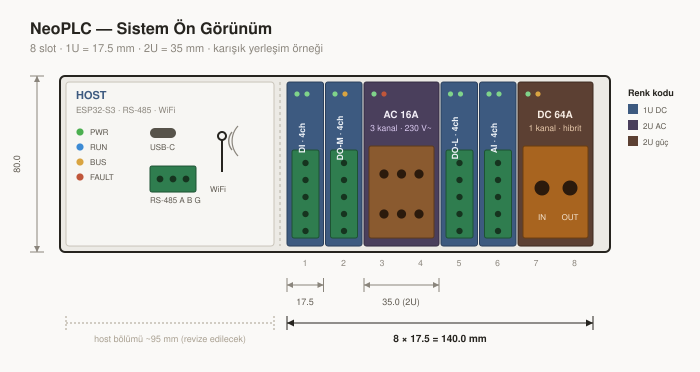

# NeoPLC — Tasarım Dokümantasyonu

NeoPLC; endüstriyel ve saha otomasyonu için tasarlanan, 12–48V DC giriş aralığında
çalışan, modüler, blade-server mantığında ölçeklenebilir bir PLC / remote I/O
platformudur.

**İlk hedef uygulama: karavan yönetimi.** Batarya beslemeli, hareketli araç,
60 °C ortam sıcaklığı. Bu bağlam [enerji bütçesini](10-enerji-butcesi.md)
birincil tasarım kısıtı yapıyor.

Bu klasör, donanım tasarımı başlamadan önce netleştirilmesi gereken **platform
standartlarını** tutar. Buradaki kararlar tek bir kartı değil, tüm node ailesinin
gelecekteki tüm üyelerini bağlar.

---

## Doküman haritası

| # | Doküman | Kapsam | Durum |
|---|---------|--------|-------|
| 00 | [Karar Kütüğü](00-karar-kutugu.md) | Tüm açık/kapalı kararların tek listesi | 🟡 Onay bekliyor |
| 01 | [Sistem Genel Bakış](01-sistem-genel-bakis.md) | Kapsam, kısıtlar, blok diyagram, node aileleri | 🟡 Taslak |
| 02 | [Host Mimarisi](02-host-mimarisi.md) | MCU seçimi, RS-485 / Wi-Fi, Modbus, GPIO bütçesi, host blade formu | 🟡 Taslak |
| 03 | [Güç Mimarisi](03-guc-mimarisi.md) | 12–48V ön kat, rail topolojisi, güç bütçesi, termal | 🟡 Taslak |
| 04 | [Backplane ve Mekanik](04-backplane-mekanik.md) | Blade mimarisi, şasi + kızak, 17.5 mm slot, **12 pin konnektör**, hava akışı | 🟡 Taslak |
| 05 | [Dahili Bus](05-dahili-bus.md) | Fiziksel katman kararı, protokol spesifikasyonu, zamanlama | 🟡 Taslak |
| 06 | [Slot Yönetimi](06-slot-yonetimi.md) | Adresleme, discovery, presence/fault/reset, güç zorlaması | 🟡 Taslak |
| 07 | [Firmware Update](07-firmware-update.md) | Bootloader, güncelleme akışı, kurtarma | 🟡 Taslak |
| 08 | [EMC ve Koruma](08-emc-koruma.md) | ESD/EFT/surge, katman sayısı kararı | 🟡 Taslak |
| 09 | [Node Aileleri](09-node-aileleri.md) | İlk node ailesi tanımları ve türetme kuralları | 🟡 Taslak |
| **10** | **[Enerji Bütçesi](10-enerji-butcesi.md)** | **Güç durumları, tüketim bütçesi, batarya ömrü — birincil kısıt** | 🟡 Taslak |
| 11 | [Çıkış Node'u Topolojileri](11-cikis-node-topolojileri.md) | MOSFET / latching röle / hibrit, DC-AC ayrımı, termal | 🟡 Taslak |
| 12 | [Mekanik Referans Rev 0.1](12-mekanik-referans-rev01.md) | Çalışma draftı + mimari çakışma tablosu | 📌 Referans |
| — | [Görseller](img/) | Mimari kararların görsel karşılıkları (SVG) | 🖼 |

---

## Durum göstergeleri

| Sembol | Anlam |
|--------|-------|
| 🟢 | Kabul edildi — tasarımda bağlayıcı |
| 🟡 | Öneri hazır, onay bekliyor |
| 🔴 | Karar verilemiyor, dışarıdan bilgi gerekiyor |
| ⚪ | Henüz ele alınmadı |

---

## Çalışma kuralları

1. **Hiçbir şema veya PCB, ilgili mimari kararlar 🟢 olmadan çizilmez.**
2. Tüm KiCAD işlemleri Konnect MCP üzerinden yürütülür. KiCAD kaynak dosyaları
   (`.kicad_sch`, `.kicad_pcb`, `.kicad_pro`, `.kicad_sym`, `.kicad_mod`,
   `fp-lib-table`, `sym-lib-table`) metin araçlarıyla düzenlenmez.
3. Bir karar değiştiğinde önce [Karar Kütüğü](00-karar-kutugu.md) güncellenir,
   sonra etkilenen dokümanlar.
4. Parça numaraları **aday** olarak işaretlenir; LCSC/JLCPCB stok doğrulaması
   yapılmadan bağlayıcı sayılmaz.

---

## Tasarım kısıtları (özet)

| Kısıt | Değer |
|-------|-------|
| Giriş gerilimi | 12–48V DC |
| Node kapasitesi | 8U (1U = 17.5 mm, 2U = 35 mm) + 2U host slotu |
| Mekanik | Blade şasi + kızak · host dahil her kart blade · toplam ~185 mm |
| Dış haberleşme | RS-485 (Modbus RTU) + Wi-Fi talep üzerine (Modbus TCP) · Ethernet opsiyonel node |
| Dahili haberleşme | Hafif özel protokol, UART mantığında |
| PCB tercihi | 2 katman — host ve node'lar |
| Tedarik ekosistemi | JLCPCB / LCSC birinci tercih |
| Hedef ortam sıcaklığı | 60 °C |
| EMC hedefi | Seviye A (ESD + EFT), sertifikasyon yok |
| Min. trace / clearance | 0.15 mm / 0.15 mm |
| Min. via drill | 0.30 mm |
| Decoupling / bulk / pull-up | 100nF X7R 0402 / 10uF X5R 0805 / 10k 0402 |
